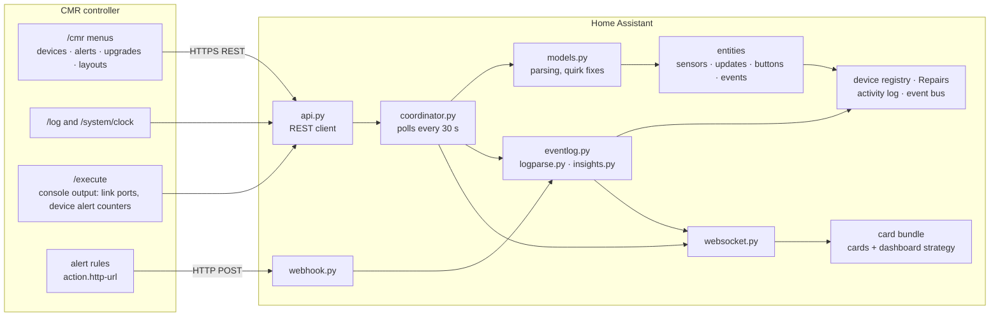

# MikroTik CMR for Home Assistant

See, monitor and upgrade a MikroTik network managed by **CMR** (the fleet
management built into RouterOS 7.26) from Home Assistant: every managed
device and its RouterOS version, the controller's alert and upgrade rules, a
live network map drawn from your CMR layouts, a timeline of what happens on
the network, and automatic detection of trouble.

Nothing is tied to one network. Point the integration at a CMR controller and
it discovers the fleet; the bundled dashboard builds itself from what it finds.

> **Status:** beta, tested with Home Assistant 2026.9 and RouterOS 7.26.
> CMR itself is new (RouterOS 7.26beta1); the
> [CMR documentation](https://manual.mikrotik.com/docs/management-tools/cmr/)
> describes the controller side. Issues and ideas are welcome.

## Quick start

1. **Controller:** on a RouterOS 7.26 router with the `cmr` package, enable
   the CMR controller and pair your devices (see the
   [CMR documentation](https://manual.mikrotik.com/docs/management-tools/cmr/)).
   Then create a user for Home Assistant and enable the REST API on that router:

   ```
   /user group add name=homeassistant policy=read,write,api,rest-api comment="Home Assistant"
   /user add name=homeassistant group=homeassistant address=<home-assistant-ip>/32 password=<choose one>
   /ip service set www-ssl disabled=no
   ```

   `write` lets Home Assistant install updates, reboot devices and approve
   pairings; leave it out for a read-only setup. Details and a certificate recipe:
   [1. Prepare the controller](#1-prepare-the-controller).
2. **Install:** in Home Assistant open **HACS → ⋮ → Custom repositories**,
   add `https://github.com/trakais/ha-cmr` as type *Integration*, then search
   HACS for **MikroTik CMR**, **Download** it and restart Home Assistant.
3. **Connect:** Settings → Devices & services → **Add integration** →
   *MikroTik CMR*. Enter the controller's address, the user from step 1,
   turn *Use HTTPS* on and *Verify the HTTPS certificate* off (self-signed).
4. **Dashboard:** reload the browser page, then Settings → Dashboards →
   **Add dashboard** → *MikroTik CMR network* and pick the controller. You get
   the Network overview, Events, Devices, Topology and Wi-Fi views.
5. **Optional:** the alerts card's *Push alerts to Home Assistant* makes
   alerts arrive instantly instead of on the next poll. *Allow actions on the
   controller* (installs, reboots, pairing approval) is on for new setups; with
   a read-only user, turn it off under the integration's *Configure*.

## Contents

- [Quick start](#quick-start)
- [What you get](#what-you-get)
- [How it fits together](#how-it-fits-together)
- [What needs what](#what-needs-what)
- [Requirements](#requirements)
- [1. Prepare the controller](#1-prepare-the-controller)
- [2. Install](#2-install)
- [3. Add the integration](#3-add-the-integration)
- [Using it](#using-it)
- [Network events and issues](#network-events-and-issues)
- [How the map is drawn](#how-the-map-is-drawn)
- [Data, storage and privacy](#data-storage-and-privacy)
- [Troubleshooting](#troubleshooting)
- [Controller quirks and limits](#controller-quirks-and-limits)
- [Development](#development)

## What you get

**In Home Assistant**

- Every CMR-managed device becomes a Home Assistant **device** (model, product
  code, serial, RouterOS version, link to its web interface), grouped under the
  controller. Newly paired devices appear on their own.
- Per device: *Connected*, *Up since*, *RouterOS version*, a **RouterOS update**
  entity (listed in Settings → Updates), a *Reboot* button, an *Alert* event
  entity, and diagnostic sensors (address, channel, upgrade rule, packages,
  labels).
- For the fleet: managed devices, devices online, updates available, active
  alert rules, last upgrade job, *Network issues*, *Network trouble*, and one
  problem sensor per alert rule.
- A **network timeline** and **issue detection** (flapping Wi-Fi clients and
  links, repeated reboots, login failures…), with issues in **Settings →
  Repairs**.
- **Instant alerts** from the controller's alert rules through a webhook.
- **Actions** (need `write` on the router user): install a RouterOS update on
  one device, reboot a device, run an upgrade rule, check for new versions,
  approve pairings, with guards against accidental downgrades.

**Cards** (bundled with the integration and loaded automatically)

| Card | Shows |
|---|---|
| Status | Controller, devices online, updates, alerts, issues, version spread |
| Topology | Live map from CMR layouts: drill into buildings, port names, PoE and SFP on cables, status per device |
| Fleet | Sortable device table with label filters |
| Alerts | Alert rules by severity, which are active, how often event alerts fired, the webhook setup script |
| Upgrades | Upgrade rules as a rollout pipeline, recent jobs |
| Events | Detected issues and the network timeline, with filters |
| Wi-Fi | The Wi-Fi networks and radio settings CMR applies, the access points they reach, and setups that leave clients without a network |

**A generated dashboard** with Network, Events, Devices, Topology and Wi-Fi views,
built from whatever fleet the controller manages.

## How it fits together



1. **Polling.** Every 30 seconds the coordinator reads the CMR menus over the
   router's REST API in parallel, plus the cable details and per-device alert
   counters (through `/execute`) and any new controller log lines. `models.py` turns the strings into typed
   data and fixes known controller quirks.
2. **Entities and the device registry** are updated from that snapshot.
3. **The event log** compares the new snapshot with the previous one, classifies
   new log lines and detected changes, runs issue detection, and raises or
   clears Repairs and events.
4. **The cards** don't use entity ids. They subscribe to the integration's two
   websocket feeds (the fleet and the timeline), so they work on any network
   without configuration.
5. **Pushed alerts** arrive at the webhook and go straight into the timeline,
   the event bus and the *Alert* event entities.

| File | Role |
|---|---|
| `api.py` | REST client; maps router errors to auth / not found / refused |
| `config_flow.py` | Setup, re-login and options screens |
| `coordinator.py` | Polling; merges cable details and alert counters from `/execute` |
| `models.py` | Parsing, version comparison, quirk fixes (pure Python, tested) |
| `entity.py`, `sensor.py`, `binary_sensor.py`, `update.py`, `button.py`, `event.py` | Entities |
| `eventlog.py` | Timeline, log reading, change detection, Repairs, events |
| `logparse.py` | Log message classification (pure Python, tested) |
| `insights.py` | Issue detection rules (pure Python, tested) |
| `webhook.py` | Alert webhook and its setup script |
| `websocket.py` | Data feeds for the cards |
| `frontend.py` | Serves and registers the card bundle |
| `logbook.py`, `diagnostics.py` | Activity-log text; diagnostics download |
| `www/` | Built cards and dashboard strategy (source in `frontend/src`) |

## What needs what

Every feature reads the controller over REST; actions (installs, reboots,
pairing, rebuilding links, cancelling jobs) need write access.

| Feature | Reads from the controller | Router user policies |
|---|---|---|
| Devices, versions, sensors, update entities | `/cmr`, `/cmr/device` | `read`, `api`, `rest-api` |
| Alert rule sensors, alerts card | `/cmr/alert` | same |
| Upgrades card, last job | `/cmr/upgrade`, `/cmr/upgrade/job` | same |
| Topology map | `/cmr/layout`, `/cmr/layout/node`, `/cmr/layout/link` | same |
| Wi-Fi card | `/cmr/wifi`, `/cmr/wifi/radio` (passphrases are discarded on arrival) | same |
| Port names, PoE, SFP, traffic on cables; per-device alert counters | `/execute` running `/cmr/layout/link/print detail` and `/cmr/device/print detail` | same (works read-only) |
| Timeline and issues | `/log` (new lines only), `/system/clock` | same |
| Instant alerts | Controller calls `POST /api/webhook/<id>` | (the controller must reach Home Assistant) |
| Install update, run rule, check versions | `/cmr/device/upgrade`, `/cmr/upgrade/trigger`, `/cmr/upgrade/version-check` | **+ `write`**, and the *Allow actions on the controller* option |
| Reboot a device | `/cmr/device/reboot` | **+ `write`**, and the *Allow actions on the controller* option |
| Rebuild a layout's links (map) | `/cmr/layout/rebuild-links` | **+ `write`**, and the *Allow actions on the controller* option |
| A job's devices, state and reason (upgrades card) | `/cmr/upgrade/job/show-devices` | `read`, `api`, `rest-api` |
| Cancel a job, run a scheduled job now | `/cmr/upgrade/job/remove`, `/cmr/upgrade/job/run-next` | **+ `write`**, and the *Allow actions on the controller* option |

The `api` policy is needed even though the integration only uses REST: REST
logins also use it internally, and without it the controller's menus appear
missing.

On the Home Assistant side the integration uses `http`, `frontend`, `webhook`,
`websocket_api` and `diagnostics`; Repairs and the activity log are used when
present (they are part of the default configuration).

## Requirements

- A MikroTik router running **RouterOS 7.26beta1 or newer** with the `cmr`
  package, acting as the **CMR controller** (controller enabled).
- The REST API reachable from Home Assistant: `www-ssl` (recommended) or
  `www`.
- Home Assistant 2026.9 or newer.
- For instant alerts only: the controller must be able to reach Home
  Assistant's address over HTTP(S).

## 1. Prepare the controller

Run on the controller (its terminal, or SSH). Replace the
addresses with yours.

**A user for Home Assistant.** With `write`, Home Assistant can also install
updates, reboot devices and approve pairings, which is the expected setup:

```
/user group add name=homeassistant policy=read,write,api,rest-api comment="Home Assistant"
/user add name=homeassistant group=homeassistant address=<home-assistant-ip>/32 password=<choose one>
```

For a read-only setup, leave out `write` and turn off *Allow actions on the
controller* in the integration's options; monitoring, the map, alerts and the
timeline all work read-only:

```
/user group set homeassistant policy=read,api,rest-api
```

Don't add `sensitive`: Home Assistant doesn't need it, and with it the REST
API returns the Wi-Fi passphrases of CMR's networks (the integration discards
them as they arrive).

To take a policy away again, negate it (`policy=read,!write,api,rest-api`); a
shorter list doesn't remove a policy that is already set.

A REST session keeps the rights it logged in with, so after changing the
group's policies **reload the integration** (Settings → Devices & services →
MikroTik CMR → ⋮ → Reload) to log in again; otherwise actions keep failing
with "not enough permissions" even though the policy is there.

**HTTPS for the REST API.** A small local CA and a certificate for the
controller's address:

```
/certificate add name=rest-ca common-name=cmr-local-ca key-usage=key-cert-sign,crl-sign days-valid=3650
/certificate sign rest-ca
/certificate add name=rest-https common-name=<controller-ip> subject-alt-name=IP:<controller-ip> days-valid=3650
/certificate sign rest-https ca=rest-ca
/ip service set www-ssl certificate=rest-https disabled=no
```

Optionally limit the service to Home Assistant:
`/ip service set www-ssl address=<home-assistant-ip>/32` (keep any addresses
you use for the web interface).

## 2. Install

The cards need no separate install: the integration serves them and loads them
on every Home Assistant page.

### With HACS (recommended)

Works on every installation type, including Home Assistant OS (Green, Yellow
and others); HACS itself is installed once, see [hacs.xyz](https://hacs.xyz).

1. HACS → ⋮ → **Custom repositories**.
2. Repository `https://github.com/trakais/ha-cmr`, type **Integration**, *Add*.
3. Search HACS for **CMR**, open it and **Download**.
4. Restart Home Assistant (Settings → System → ⋮ → *Restart Home
   Assistant*).

HACS then offers new versions like any other integration.

### Without HACS on Home Assistant OS (Green, Yellow and others)

The integration is one folder, `custom_components/cmr`, that has to end up in
Home Assistant's `config` folder. On Home Assistant OS you reach that folder
through an add-on (Settings → Add-ons → **Add-on store**). Pick one:

**Terminal** (*Terminal & SSH* add-on). Open the add-on's terminal and paste:

```
mkdir -p /config/custom_components
curl -sL https://github.com/trakais/ha-cmr/archive/refs/heads/main.tar.gz | tar -xz -C /tmp
rm -rf /config/custom_components/cmr
cp -r /tmp/ha-cmr-main/custom_components/cmr /config/custom_components/
rm -rf /tmp/ha-cmr-main
```

**Network share** (*Samba share* add-on; set a username and password in its
configuration and start it):

1. On your computer, download this repository: **Code → Download ZIP**, and
   extract it.
2. Open the share `\\homeassistant.local\config` (Windows) or
   `smb://homeassistant.local/config` (macOS Finder → Go → Connect to Server).
3. Copy the extracted `custom_components/cmr` folder into the share's
   `custom_components` folder (create it if it's missing).

**In the browser** (*Studio Code Server* add-on): open it, and drag the
extracted `custom_components/cmr` folder from your computer onto the
`custom_components` folder in its file explorer (create it if it's missing).

Then restart Home Assistant (Settings → System → ⋮ → *Restart Home
Assistant*).

**Updating without HACS:** repeat the same steps (they replace the folder),
restart Home Assistant, then reload the browser page.

### Other installations (Container, Core)

There are no add-ons: copy `custom_components/cmr` into the `custom_components`
folder of your Home Assistant configuration directory (the terminal commands
above work with your config path instead of `/config`) and restart.

## 3. Add the integration

Settings → Devices & services → Add integration → search **CMR**.

| Field | Value |
|---|---|
| Controller address | IP or host name of the controller, optionally `:port` |
| Username / password | The user from step 1 |
| Use HTTPS | On for `www-ssl` |
| Verify the HTTPS certificate | Off for the self-signed certificate above |

If something is wrong, the form shows the router's own error text; see
[Troubleshooting](#troubleshooting).

**Then reload the browser page.** The cards and the dashboard are loaded when
a page opens, so a page that was open before the integration was added doesn't
have them yet.

**Options** (the integration's *Configure* button):

| Option | Default | What it does |
|---|---|---|
| Polling interval | 30 s | How often the controller is read (10–600 s) |
| Home Assistant address | Home Assistant's internal URL | The address the controller uses for alert webhooks |
| Allow actions on the controller | on (new setups) | Adds *Install* to update entities, a *Reboot* button per device, the upgrade buttons, and *Approve* for devices waiting to be paired; needs `write` |
| Home Assistant activity log | Notable events | Which timeline events also appear in the activity log: notable, all, or none |
| Issue detection (collapsed section) | 5 Wi-Fi drops / 15 min, 3 link flaps / 30 min, 3 disconnects / 1 h, 2 reboots / 24 h, 5 login failures / 10 min, 1 failed alert action / 1 h, offline after 15 min | How many occurrences inside each rule's window raise an issue; 0 turns a rule off |

Options apply immediately, except *Allow actions on the controller*, which reloads
the integration. To move to a new address, user or HTTPS setting, use
*Reconfigure* on the entry (⋮ menu) instead of deleting it; the entry keeps
its entities and history.

## Using it

### The generated dashboard

Settings → Dashboards → **Add dashboard** → the *MikroTik CMR network* dashboard (under
*Community dashboards*). It has five views:

- **Network:** status, topology, devices, alerts, events (notable ones),
  upgrades.
- **Events:** the full timeline and active issues.
- **Devices:** the device table; for fleets of up to 24 devices also a
  24-hour connectivity timeline and a section per device.
- **Topology:** the map, full screen.
- **Wi-Fi:** the Wi-Fi networks and radio settings CMR applies and the access
  points they reach, with warnings for setups the CMR guide says don't work
  (a network without a VLAN leaves its clients without network access; radio
  settings without a band label reach every band). Live client counts aren't
  available from the controller's API yet.

It regenerates from the fleet every time it opens. To customise it, use *Take
control* in the dashboard menu.

**Several controllers:** add one *MikroTik CMR network* dashboard per controller.
*Add dashboard* asks which controller (empty: the first one); ✏️ *Edit
dashboard* changes it later. In YAML:

```yaml
strategy:
  type: custom:cmr
  entry_id: <config entry id>   # ⋮ on the integration entry → Copy entry ID
  link_style: elbow            # optional: straight (default) or elbow
```

### Cards on your own dashboards

Add them from the card picker (search "CMR"), or in YAML. Card types are
`custom:cmr-<name>-card`. All options are optional; `entry_id` picks a
controller when you have several.

```yaml
- type: custom:cmr-status-card
  views:                    # optional: dashboard views its drill-downs can open
    devices: devices
    events: events

- type: custom:cmr-topology-card
  layout: Overview          # start in this CMR layout (default: the top one)
  height: 480               # minimum; the map grows to fit the layout's shape
  max_height: 900           # … up to this (default: 85% of the window)
  show_ports: true          # port names at both ends of each cable
  show_comments: true       # link comments on cables without detected ports
  link_style: elbow         # right-angle cables; default: straight
  icons:                    # icons for layout nodes that open another layout
    House: mdi:home

- type: custom:cmr-fleet-card
  labels: [ap]              # only devices with all of these CMR labels
  status: offline           # or pending, alert, update, ok: a permanent "offline devices" card
  fold_after: 50            # above this many rows the healthy devices fold into one line
  compact: false            # true: only devices needing attention, a few rows, link to the full table

- type: custom:cmr-alerts-card
  hide_disabled: true

- type: custom:cmr-upgrades-card
  jobs: 5                   # recent jobs to list

- type: custom:cmr-events-card
  notable: true             # start on notable events (issues, devices, alerts, …)
  max_items: 20
  device: Office-AP         # only events about this device (its identity)
  hide_categories: [api]    # the default; API logins are routine

- type: custom:cmr-wifi-card
  title: Wi-Fi
```

On the map: click a building to open its layout, hover a cable for its
ports, PoE and traffic. Hover a device for its details and the cables it uses;
when the product catalog lists the model, a drawing of its front panel lights
those ports and marks the ones that power a device (the catalog gives port
counts, so the arrangement is an approximation). Click or tap a device for
the same card with its address to copy and links to install its update, its
Home Assistant device page and its row in *Devices*, and, with actions
allowed, *Reboot*. Pinch or Ctrl/⌘-scroll zooms, drag (one finger on a phone)
pans, double-click zooms in on that spot, ⤢ shows the whole map.
Zoomed far out, devices become status dots, then names, then full cards.
*Find on map* dims everything that doesn't match a name, address or label
(Enter zooms to the matches), and the amber ! button zooms to whatever needs
attention. On a
phone the map opens at a readable size from its left edge.

With *Allow actions on the controller* on, an administrator sees a cable
button on a layout with devices: *Rebuild links* creates that layout's links
from the ports the controller detected between its devices (`track-topology`
must be on), so a layout filled with `add-devices` gets its cables without
the controller's own GUI. Connections the controller can't detect, such as a
VPN or a switch it doesn't manage, stay links you draw yourself.

Finding what needs attention in a large fleet: the device table lists
offline, waiting-to-pair, alerting and updatable devices first; the chips
above it (*Offline 3*, *Updates 12*, …) filter to one status, the label chips
and the search box narrow further, a version is a filter when clicked, and
above `fold_after` rows the healthy devices fold into "995 devices online and
up to date — show them". The status card's tiles open the same lists inline
(offline since when, update from → to, active alert rules, issues, devices to
approve), and the version bar lists who runs what. An active rule opens to the
devices it is active on, with *Show in Devices* (the table filtered to them)
and *Show on map* (everything else dimmed). In the generated dashboard the panel's
*Open in Devices* jumps to the device table with that filter;
`?cmr_status=offline`, `?cmr_version=…`, `?cmr_search=…` and
`?cmr_alert=<rule id>` on a dashboard URL do the same for your own dashboards.

### Entities

Entity ids follow the device identity, e.g. for a device named `Office-AP`:

| Entity | Example |
|---|---|
| Connected | `binary_sensor.office_ap_connected` |
| Up since | `sensor.office_ap_up_since` |
| Active alerts | `sensor.office_ap_active_alerts` |
| RouterOS update | `update.office_ap_routeros` |
| Last alert (pushed) | `event.office_ap_alert` |
| Reboot (with actions allowed) | `button.office_ap_reboot` |

Each device also has diagnostic sensors (RouterOS version, channel version,
update channel, upgrade rule, address, packages, labels, connected since).
They are **disabled by default** — with hundreds of devices they would add
thousands of entities — and can be enabled per device on its page. The cards
don't need any of them.

On the controller's device: `sensor.<controller>_devices_online`,
`_updates_available`, `_active_alert_rules` (`_alert_rules_firing` on older
installations), `_network_issues`, `binary_sensor.<controller>_network_trouble`,
one `binary_sensor.<controller>_alert_<rule>` per alert rule (on while the
rule's state alert is active; an event alert's stays off), and with upgrades
allowed `button.<controller>_check_for_new_versions` and
`button.<controller>_run_upgrade_rule_<rule>`.

### Events for automations

| Event | When | Useful data |
|---|---|---|
| `cmr_alert` | The controller pushed an alert (not for a rule's *Test*) | `alert`, `severity`, `device`, `message`; where they apply `upgrade_error`, `upgrade_state`, `upgrade_version`, `job_devices`, `job_upgraded`, `iface`, `iface_change` |
| `cmr_issue` | An issue was detected or cleared | `action` (`raised`/`resolved`), `kind`, `title`, `detail`, `device_id` |
| `cmr_event` | A notable timeline event | `category`, `severity`, `title`, `device_name`, `device_id` |

```yaml
# Phone notification for every detected network issue
triggers:
  - trigger: event
    event_type: cmr_issue
    event_data:
      action: raised
actions:
  - action: notify.mobile_app_phone
    data:
      title: "{{ trigger.event.data.title }}"
      message: "{{ trigger.event.data.detail }}"
```

```yaml
# A managed device has been offline for 10 minutes
triggers:
  - trigger: state
    entity_id: binary_sensor.office_ap_connected
    to: "off"
    for: "00:10:00"
actions:
  - action: notify.mobile_app_phone
    data:
      message: "Office-AP lost the CMR controller"
```

### Pairing new devices

Both sides must agree before the controller manages a device. With the
controller's default `pairing-requirement=confirm`, every new device that
connects waits for approval on the controller. The integration turns that
into a Repair issue (*Settings → Repairs*): "*Office-AP* is waiting to be
paired". With *Allow actions on the controller* on, the issue is fixable
and approves the pairing; the *Devices* card shows an *Approve* button on
the row as well. A device whose own side still has to agree shows "waiting
for approval on the device" instead, with the command to run there.

For a phone notification, listen for the timeline event:

```yaml
trigger:
  - trigger: event
    event_type: cmr_event
    event_data:
      category: device
      data:
        event: pending
action:
  - action: notify.mobile_app_phone
    data:
      title: "New network device"
      message: "{{ trigger.event.data.title }}"
```

### Alerts in real time

CMR has two kinds of alert rules
([CMR documentation](https://manual.mikrotik.com/docs/management-tools/cmr/#alert-rules)):

- A **state alert** (CPU, memory, disk or health thresholds, connected or
  disconnected, an available update) stays active on a device while its
  conditions hold and runs its actions once when it becomes active. The
  cards count these: *alerts active*, a device's alert status, and the
  *active / covered* devices of a rule.
- An **event alert** (an unexpected reboot, a finished device upgrade or
  upgrade job, an interface change, a log line, an unpaired device
  connecting) runs its actions for every occurrence and never stays active,
  so it never shows as active anywhere. The cards show how often it fired;
  the timeline gets "Alert *rule* fired 3 times" from each poll, or every
  single occurrence when the rule pushes to Home Assistant. A finished
  upgrade job is about the whole job, not a device.

Polling sees alert rules change state within 30 seconds. To get each alert the
moment it fires, press *Push alerts to Home Assistant* on the alerts card.
With *Allow actions on the controller* on, that sets every alert rule's HTTP
action to Home Assistant's webhook (POST, JSON body with the rule's name,
severity and category and, where the alert has them, the upgrade result, the
job's counts and the interface change, all filled in by the controller) and
*Stop pushing* clears exactly those again; rules that point at
some other webhook are left alone. Without actions, the card shows the
equivalent script to paste into the controller's terminal; edit its `find`
to choose rules. The address the controller calls comes from the *Home
Assistant address* option. Rules set up by an earlier version keep working;
the card offers *Update* to give them the newer fields. The controller's
*Test* on a rule shows in the timeline as a test push and triggers nothing.
Setting or clearing the HTTP action changes the rule, and the controller
then runs the actions of an active state alert again (its log line, script
and push), so alerts that are active arrive once more.

Which devices a state alert is active on is read through `/execute` (the
console's list carries device ids), like the device alert counters (the user
from *Prepare the controller* may). An event alert is never active, so there
is nothing to list for it. A user
that is not allowed console commands gets the counts only, and the cards say
so.

### Upgrades

With *Allow actions on the controller* on and `write` on the router user:

- **Install** on a device's RouterOS update upgrades that one device to the
  version its channel offers, the same way as the controller's own *Upgrade*
  button, so the controller downloads the packages it needs. It only offers
  versions newer than the installed one. A different version asked for
  explicitly (`update.install` with `version`) is pinned instead, and the
  controller installs a pinned version only from packages it already has
  (its packages directory or cache).
- **Run upgrade rule** starts that rule's job now. It refuses while the rule's
  channel would move any device to an *older* version (the controller treats
  any different version as an upgrade); the button's attributes list the
  devices that would upgrade or downgrade.
- **Check for new versions** asks the controller to check its channels now.
- **Reboot** (a device's button, or *Reboot* on its card on the map, after a
  confirmation) restarts it through the controller; it is back in about a
  minute.

Progress shows on the update entity while the job runs (a job that fails,
for example with *no upgrade available*, ends it at once), and in the upgrades
card's job list. Select a job there to see its devices with the controller's
state and reason for each, for example *no upgrade available*, which CMR
counts as a failed device upgrade. A scheduled job lists its devices once it
starts. Administrators also get:

- **Run now** on a scheduled job: a rule's job starts as a new job and the
  scheduled one stays scheduled; a one-off install runs now instead of at its
  time.
- **Cancel job** on a scheduled, queued or running job. A running job stops,
  and its devices that aren't upgraded yet are marked cancelled; an install
  already under way can still finish when its device reboots.

## Network events and issues

The timeline keeps the last 1,000 events, also across restarts. It has three
sources, all generic:

- **The controller's log**, new lines only, classified by the standard router
  message formats: Wi-Fi joins, drops and roaming (attributed to the access
  point whose identity appears in the interface name), link up/down, logins and
  login failures, configuration changes with who made them, DHCP, reboots.
  CMR's own lines (upgrades, alert actions written to the log) go to the
  device they name. Logins over `api`/`rest-api` are filed as routine, and
  the integration's own are left out.
- **Changes between polls**: devices going offline or coming back, reboots
  (uptime went down), version changes, new, paired or removed devices, state
  alerts becoming active and clearing, event alerts firing (unless they push
  every occurrence), upgrade jobs.
- **Alerts pushed** to the webhook.

**Issues** are patterns across events:

| Issue | Raised when | Clears after |
|---|---|---|
| Wi-Fi client keeps dropping | 5 disconnects in 15 min (hint from the signal strength) | 30 min quiet |
| Link keeps going down | 3 link-downs in 30 min | 30 min quiet |
| Device keeps losing the controller | 3 disconnects in 1 h | 1 h quiet |
| Device rebooted repeatedly | 2 reboots in 24 h | 24 h quiet |
| Repeated login failures | 5 failures from one source in 10 min | 1 h quiet |
| Device offline | disconnected for 15 min | it reconnects |
| Alert action failing | a rule's action (e.g. webhook) failed | 1 h without failures |

Each issue appears in Settings → Repairs, in *Network issues* / *Network
trouble*, at the top of the events card, and fires the issue event. Issues
resolve themselves after the quiet period; an administrator can also dismiss
one with its ✕ (events card or the status card's issues panel) — its counted
occurrences are forgotten, so it comes back only on new ones, and a dismissed
"offline" issue stays quiet until the device has been back online once. Wi-Fi
clients are named from Home Assistant's device registry when another
integration knows their MAC address, otherwise from DHCP lease names in the
log.

## How the map is drawn

Everything on the map comes from the controller; nothing is matched against
names or comments.

- **Layouts, positions and links** come from the CMR layouts you arrange in
  the controller's layout editor. Nodes without saved coordinates are placed in a row below the others.
  Without any layouts, the map puts the controller on top and every other
  device in a row below it.
- **Ports, PoE and traffic.** REST leaves out a link's detected ports, so they
  are read from the console's `print detail` output through `/execute`. Each
  cable shows the port at both ends next to its own device; ⚡ marks the port
  that supplies PoE, and amber pulses run toward the device it powers. SFP
  ports are drawn as fiber, `ether`/`combo` as copper, `wifi` as wireless.
- **Links between layouts** (two buildings on an overview) use the device cable
  that joins them.
- **Links with no detected ports** are dashed and show their comment.

**Elbow links:** choose *Map link style → Elbow (right angles)* in the generated
dashboard's editor, or *Link style* in an individual map card's editor. Cables
follow long horizontal and vertical runs with small rounded corners. Links
leaving the same side of a device share a branch lane where space allows;
nearly aligned nodes connect straight along their card edges without a tiny
zigzag. Routes avoid intervening cards. Port labels at a shared attachment
are grouped (hover for the individual ports and peers), and hover details
and PoE pulses follow each cable. Straight remains the default. This setting
changes only the Home Assistant drawing.

**Edit layout:** Home Assistant administrators with *Allow actions on the
controller* enabled can rearrange an existing CMR layout. Select *Edit layout*,
drag a node, or focus it and use the arrow keys (Shift moves farther). *Snap to
grid* aligns positions to a 20-unit grid. *Save to CMR* writes the changed
positions to the controller; *Cancel* discards the draft. The same positions
are then visible in CMR's own editor. The origin stays at the layout center;
negative coordinates are valid, x increases rightward and y downward.

Editing moves existing device, layout and unmanaged nodes; it does not create
nodes or edit the generated *All devices* fallback. Each changed node is
checked against the controller before saving, so a stale draft is rejected.
Saves are verified by reading the positions back. If some writes fail, the
editor lists them and retains the unsaved changes; CMR cannot save a group of
nodes as one atomic operation.

## Data, storage and privacy

- Everything stays on your network: the integration talks only to the
  controller, and the controller only to Home Assistant (webhook). The one
  exception is the product catalog, which adds product photos, names and port
  counts to devices: Home Assistant fetches MikroTik's public product list
  from `api.mikrotik.com` once a day, and browsers load the photos from
  `cdn.mikrotik.com`. Without internet access the cards simply go without them.
- Each poll makes about ten small REST requests; the log is read from the last
  seen line on, filtered by the controller.
- The timeline and issue state are stored in Home Assistant's `.storage`
  folder, one file per controller.
- The diagnostics download redacts the username, password, webhook id and CMR
  key ids.

## Troubleshooting

| Symptom | Cause and fix |
|---|---|
| Setup says "This router has no /cmr menu" | The user's group lacks `api` (REST needs it), or the `cmr` package/controller isn't enabled. |
| Setup says "Can't reach the REST API" | `www-ssl` disabled, a firewall, the service's `address` list, or *Use HTTPS* doesn't match the service. If Home Assistant runs in a VM or container, check it can route to the controller. |
| "The controller rejected the login" | Wrong password, or the user's `address` doesn't include Home Assistant's address. |
| Cables have no port names | The controller didn't detect ports for that link (it shows dashed), or `/execute` was refused; the log says so once. |
| The events card stays empty | The user can't read `/log`, or the controller's log is empty. Check the integration's debug log. |
| No upgrade buttons | Turn on *Allow actions on the controller* in the options. |
| "The controller refused to upgrade …" | The user lacks `write`, or the controller refused the job; the message carries its reason. |
| The dashboard says it couldn't be built | Reload the page. If it stays, check that the integration is loaded. |
| *MikroTik CMR network* is missing under Add dashboard, or cards show "Custom element doesn't exist" | Add the integration first (the cards are served by it), then reload the browser page. |

Debug logging:

```yaml
logger:
  logs:
    custom_components.cmr: debug
```

## Controller quirks and limits

Handled by the integration:

- **Older versions offered as upgrades.** By design, the controller's
  "upgrade available" flag means the device's channel offers a *different*
  version, which can be older (a device on a testing build whose rule uses
  `stable`). The update entity compares RouterOS versions (dev builds < beta
  < rc < release) and only offers newer ones; an explicit version pin is the
  user's call.
- **Negative layout coordinates** come back as unsigned 32-bit numbers
  (`4294967294` for −2) and are converted back.
- **REST omits computed fields**: a link's detected ports (`links`) and a
  device's alert counters (`alerts`) are missing from REST responses, and
  neither `proplist` nor `get` returns them. They are read from the console's
  `print detail` output through `/execute`, so they need a user that may run
  console commands; a stricter user just goes without them (no port chips on
  cables, no per-device *Active alerts* sensor).

Not available yet:

- `print as-value` of `/cmr/layout/link` returns nothing on the console.

## Development

```
dev/ha.sh up                        # Home Assistant 2026.9 on http://localhost:8123
cd frontend && npm install
npm run watch                       # rebuilds the card bundle on change
python3 -m pytest tests             # parsing, versions, log classification, issue rules
```

The integration tests in `tests/integration/` load a config entry in a real
Home Assistant against a recorded controller (`tests/fixtures/controller.json`)
and check the devices, entities, config flow, websocket payload, webhook and
diagnostics. They need the Home Assistant test harness, which wants the
Python version the current Home Assistant release uses:

```
uv venv --python 3.14 .venv && source .venv/bin/activate
pip install pytest-homeassistant-custom-component home-assistant-frontend ruff
pytest tests                        # everything; the integration tests are skipped without the harness
ruff check custom_components tests
```

GitHub Actions runs the same on every push: tests, ruff, the TypeScript type
check, a build that must leave `www/cmr.js` unchanged, hassfest and HACS
validation.

| Path | |
|---|---|
| `custom_components/cmr/` | The integration |
| `frontend/src/` | Card and strategy sources (TypeScript, Lit, built with esbuild) |
| `tests/` | Unit tests for the pure-Python modules |
| `dev/` | Dev Home Assistant (`ha.sh`), its config template, the router relay |

- The integration is mounted live into the dev container; restart after Python
  changes (`dev/ha.sh restart`). Card changes need only a browser reload.
- The dev instance's owner and API token are generated into the git-ignored
  `dev/config/`.
- If the container can't reach the controller (Colima's network may not follow
  VPN or ZeroTier routes), run `dev/router-relay.py <controller>:443 18443` on
  the Mac and add the integration with host `192.168.5.2:18443`.
- The built card bundle (the integration's `www/` folder) is committed so
  the repository installs without a build step. Before a release:
  `npm run build`, run the tests, bump `version` in `manifest.json`.

## License

MIT, see [LICENSE](LICENSE).
